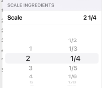

|                 |                                                                                                                                                               |
|-----------------|---------------------------------------------------------------------------------------------------------------------------------------------------------------|
| Date:           | 18/12/2025                                                                                                                                                    |
| Time (planned): | 16:45 - 17:30                                                                                                                                                 |
| Time (actual):  | 16:48 - 17:26                                                                                                                                                 |
| Location :      | Flux Hall D                                                                                                                                                   |
| Chair           | Teammate 4                                                                                                                                       |
| Minute Taker    | Lukas Brookfield                                                                                                                                              |
| Attendees:      | Teammate 2, Teammate 1, Teammate 4, Lukas Brookfield, Teammate 5, Teammate 3 |
| Absent:         | Teammate 1 and Teammate 3 were absent but attended online                                                                                                        |
## Opening + overview of last week (est. 10 min) - Actual duration: 3 min
* The meeting started at 16:48 with a short introduction from Teammate 4 (the chair)
### Individual contributions
  * **Teammate 4:** Completed all his issues including web sockets for auto-synchronization of database changes, normalization for units e.g. 1000g = 1kg
  * **Lukas:** Completed all his issues including added way to favourite recipes on frontend and added tests for user config
  * **Teammate 2:** Completed some of his issues including cloning recipes, home scene and UI bug fixes. Didn't do his issue for testing for recipe/ingredient overview
  * **Teammate 1:** Completed all his issues including a basic shopping list and some basic tests for the shopping list
  * **Teammate 3:** Hasn't contributed as of Thursday but will do his issues before Friday midnight
  * **Teammate 5:** Hasn't contributed as of Thursday but will do his issues before Friday midnight
### Discuss the action list of last week
  * **Nutritional values:** Has not been completed yet but Teammate 3 will do it for his issues
  * **Util classes e.g. for nutritional value:** Has not been completed yet but Teammate 3 will do it for his issues
  * **Create a settings menu (American measurement system):** This feature has not been implemented yet but might be in the future for the live language switch
  * **Websocket updates:** Teammate 4 completed this for his issue
  * **Tests for frontend:** Lukas did some for user config, tests still need to be done for recipe/ingredient overview
  * **Density for ingredients:** Lukas did this for his issue
  * **Favourite recipes:** Lukas did this for his issue
## Announcements by the team (est. 1-2 min) - Actual duration: 2 min
  * **Buddycheck:** No concerns/feedback were raised by the team
  * **Issues regarding gitlab outage:** No issues were encountered by the team
  * Teammate 4: When someone completes an implemented feature, they should tick it off in notion so everyone knows it has been done 
## Announcements by the TA (est. 3 min) - Actual duration: 1 min
  * The technology formative feedback will not be done soon. It will most likely be done by the end of the Christmas holidays, so we have time until week 7 to fix anything
## Presentation of the current app to TA (4 min) - Actual duration: 4 min
### The team showed the new features for the week, including:
  * Adding recipes and ingredients and ingredient normalization
  * Web sockets
  * Favourite recipes
  * Filter by favourite recipes
  * Cloning recipes (final part of basic requirements)
  * Shopping list 
  * Home page
  * Density and nutritional value as part of ingredient types
## Talking Points: (est. 13-17 min) - Actual duration: 22 min
### Warnings and client-side validation for ingredient amount:
  * Teammate 4: There should be a warning when an invalid amount is entered on the frontend, he has created an issue for this
  * Teammate 5: There should be a warning when a shopping list ingredient doesn't exist in database
  * Teammate 1: There should be a warning if an ingredient type is added without density or nutritional values
  * Teammate 3: There should be an additional warning when nutritional values aren't added to an ingredient type, stating that the calories per 100g can't be calculated for that ingredient type
  * **Final decision:** New issues will be created regarding these warnings
### Data propagation via websockets for the shopping list and favourite recipes:
  * Teammate 4: When a new ingredient type is added in the ingredient/recipe overview or shopping list it should also be saved using web sockets (currently this is not happening)
  * Everyone agrees this would be a good feature to have
  * **Final decision:** Teammate 4 will implement this next week or at a later date
### Does everybody agree with the current database structure:
  * Teammate 2: The structure is not bad, but the implementation of certain classes is wrong and causes bugs. He has changed it so that it works for now
  * Teammate 5: Ingredient could be a composite attribute of Recipe
  * Lukas: We have to be careful with large changes to the database structure as it can quickly break the whole program and cause large refactoring to be needed
  * Teammate 4: There may be issues to do with Jsonignore and cyclical Json mapping. It works for now though
  * **Final decision:** No action will be taken for now in terms of the database structure
### How are we going to implement recipe scaling:
  * The options are only allowed discrete values, e.g. 1x, 2x, etc. or any double
  * Teammate 3: Thinks there should be discrete values at intervals e.g. 0.5x, 1x, 1.5x, etc.
  * Teammate 3: Has seen the design below online which he will try to emulate
  * 
  * **Final decision:** Teammate 3 will do this as part of his issues for the week, or will postpone it to next week depending on how much he can get done
### Should we start implementing the live language switch in week 7, and how are we going to do it:
  * Teammate 4: It will need a large amount of refactoring so we should start early 
  * Teammate 3: Agreed that we should do it next week
  * **Final decision:** Teammate 5 will start on this next week
  * Teammate 4: How are we going to store the languages and flags?
  * TA: Added that flags can't be stored as emojis on windows
  * Lukas and Teammate 4: Suggested to store them client-side as images
  * Teammate 4: Suggested making a hash map containing the language names with their image locations
  * **Final decision:** We should store the language icons as images on the client side
### Extra points:
  * Teammate 3: We are missing tests, and we get a penalty if we do them at the end so this should be a priority
  * **Final decision:** Lukas and Teammate 2 will do tests for recipe overview and ingredient overview respectively
## Summarize action points: who, what, when? (est. 2 min) - Actual duration: 1 min
### Teammate 2
  * Fix the database and client-server connection
  * Ingredient overview tests 
### Lukas
  * Recipe overview tests 
### Teammate 4
  * Add client-side user input validation and warnings
### Teammate 5
  * Implement an interactive language dropdown menu
### Teammate 1
  * To be decided
### Teammate 3
  * To be decided
## Feedback round: what went well and what can be improved next time? (est. 2 min) - Actual duration: 3 min
  * Everyone has done their part most of the time :)
  * Sometimes we have to move issues to the next milestone, though this is actually part of the rubric so we are awarded points for this
  * We are making good progress and should have plenty of time to implement all the features in the backlog before the end of the course
  * We should read the formative feedback to make sure all the rubric is covered
  * Some of the issues are old and keep getting extended, which is not good
## Question round: does anyone have anything to add before the meeting closes? (est. 2 min) - Actual duration: 1 min
  * No questions were asked
## Closure (est. 1 min) - Actual duration: 1 min
  * Have a great holiday everyone 🎉🎉🎉
